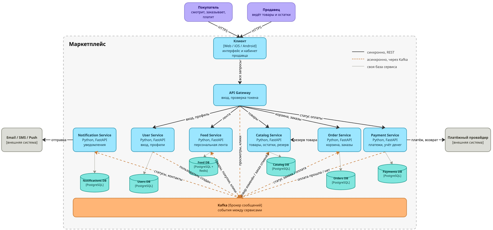

# hw1_service_oriented_structures
В Docker поднят Catalog Service, он отвечает 200 OK на /health.

Для запуска скачиваем:

```bash
git clone https://github.com/yanantro/hw1_service_oriented_structures.git
cd hw1_service_oriented_structures
docker compose up -d --build
```

Проверка сервиса:

```bash
curl -i http://localhost:8000/health
```

Должно прийти `HTTP/1.1 200 OK`

Внутри контейнера настроена автоматическая проверка здоровья. Docker каждые 10 секунд сам обращается к `/health`. Посмотреть можно так:

```bash
docker inspect --format '{{.State.Health.Status}}' catalog-service
```

Через несколько секунд после запуска там должно быть `healthy`.

Остановка сервиса через `docker compose down`.

## Файлы

- `README.md`
- `диаграмма_С4.png`
- `docker-compose.yml` запуск сервиса одной командой. В нём указано, где лежит Dockerfile и что порт 8000 контейнера открывается наружу
- `services/catalog-service/` - это сам сервис:
  - `app/main.py` код сервиса на FastAPI. В нём есть эндпоинт `/health`, который возвращает статус 200 и `{"status": "ok"}`
  - `Dockerfile` инструкция, как собрать контейнер: взять образ с Python, установить зависимости, скопировать код, запустить сервер на порту 8000. Там же настроена проверка здоровья
  - `requirements.txt` библиотеки, которые нужны сервису
  - `requirements-dev.txt` то же самое плюс библиотеки для тестов
  - `tests/test_health.py` тест, который проверяет, что `/health` возвращает 200

## Диаграмма C4 Container
https://miro.com/app/board/uXjVEfNOJ1g=/?share_link_id=512788652361



- Пользователи двух типов: покупатель и продавец. Они работают с маркетплейсом через веб или мобильное приложение.
- Внутри маркетплейса:
  - клиентское приложение (веб и мобильное)
  - API Gateway, через который проходят все запросы от клиента
  - шесть сервисов, такие как пользователи, каталог, лента, заказы, платежи, уведомления
  - у каждого сервиса своя база данных !
  - брокер сообщений Kafka, через который сервисы обмениваются событиями
- Снаружи две внешние системы: платёжный провайдер (он принимает оплату картой) и сервисы отправки email, смс и пушей.

На каждой стрелке подписано, что передаётся и каким способом (синхронно - REST или асинхронно через Kafka).

## Домены

Из каких областей состоит маркетплейс, и что входит в каждую:

1. Пользователи - регистрация и вход, роли (покупатель или продавец), профили, адреса доставки, контакты.
2. Каталог - карточки товаров, категории, характеристики, цены. Продавцы создают и редактируют свои товары, покупатели их просматривают.
3. Остатки, то есть сколько единиц товара есть в наличии. Когда покупатель оформляет заказ, товар резервируется, чтобы его не купил кто-то другой. Если заказ отменили, резерв снимается.
4. Лента - это подбор товаров для конкретного пользователя на главной странице. Сюда же входит сбор данных о том, что пользователь смотрит и покупает.
5. Заказы - корзина, оформление заказа и его статусы: ждёт оплаты, оплачен, отправлен, доставлен, отменён.
6. Платежи, где приём оплаты через платёжного провайдера, возвраты, учёт всех денег, комиссия маркетплейса и выплаты продавцам.
7. Уведомления - сообщения покупателю и продавцу, когда что-то происходит с заказом (заказ оплачен или отправлен).

### Персонализация ленты

- Собираем, что пользователь смотрел, на что кликал, что добавлял в корзину и что покупал.
- По этим действиям понимаем, какие категории ему интересны.
- Затем в ленту попадают популярные товары из этих категорий и товары, которые часто покупают вместе с тем, что он уже купил.
- Товары сортируются по простой формуле:
 интерес к категории * популярность товара * новизна.
Так наверху оказываются свежие и популярные товары из любимых категорий.
- Новому пользователю, про которого ещё ничего не известно, показываем просто популярные товары.

Ленту я считаю заранее и храню в Redis. Redis хранит данные в оперативной памяти, поэтому лента отдаётся очень быстро и не нужно считать её заново на каждый запрос. Когда пользователь что-то смотрит или покупает, лента дообновляется.

## Какие домены в каких сервисах

User Service отвечает за пользователей. Тут всё, что касается того, кто пользователь и что ему можно делать.

Catalog Service отвечает за каталог и остатки. Я объединила их, потому что остатки по сути свойство товара, и продавец меняет их в той же карточке. Но главная причина в другом. Когда покупатель оформляет заказ, нужно проверить, есть ли товар, и сразу его зарезервировать. Если бы остатки жили в отдельном сервисе, между проверкой и резервом кто-нибудь мог бы успеть купить последний товар.

Feed Service отвечает за ленту. Ленту открывают гораздо чаще, чем покупают, поэтому её удобно масштабировать отдельно. Ещё логику ленты придётся часто менять, и это не должно задевать заказы. И если лента вдруг упадёт, магазин всё равно должен работать.

Order Service отвечает за заказы. Корзину я положила сюда же, потому что корзина это по сути черновик заказа.

Payment Service отвечает за платежи. Это деньги, и нужен закрытый доступ, поэтому платежи я вынесла отдельно от всего остального.

Notification Service отвечает за уведомления. Он только получает события и рассылает сообщения, на другие сервисы никак не влияет. Его можно менять независимо.

Также в системе есть API Gateway. Клиентское приложение отправляет все запросы на один адрес, gateway проверяет, что пользователь вошёл в систему, и передаёт запрос нужному сервису. Своих данных у него нет. И клиенту не нужно знать адреса всех шести сервисов.

## Кто какими данными владеет

Если сервису нужны чужие данные, он может либо спросить владельца через api, если данные нужны прямо сейчас, либо держать у себя копию нужных полей. Когда владелец сообщает об изменениях через события, копия обновляется. Менять её сам сервис не может, она только для чтения.

User Service хранит в PostgreSQL аккаунты, хэши паролей, роли, профили и адреса. Отвечает за регистрацию, вход и профили.

Catalog Service хранит в PostgreSQL товары, категории, цены, остатки и резервы. Отвечает за ведение каталога и резерв товара под заказ.

Feed Service хранит действия пользователей в PostgreSQL, а готовые ленты в Redis. Отвечает за сбор и выдачу ленты. У него есть копия части каталога, id товара, категория и цена. Без неё он не смог бы собирать ленту, а ходить за каждым товаром в Catalog было бы слишком медленно.

Order Service хранит в PostgreSQL корзины, заказы, историю статусов и цену товара на момент покупки. Цену я храню прямо в заказе, потому что продавец может поменять её завтра, а заказ должен помнить, сколько стоил товар, когда его купили.

Payment Service хранит в PostgreSQL платежи, возвраты, проводки, комиссии и выплаты продавцам. Отвечает за работу с платёжным провайдером и учёт денег.

Notification Service также хранит в PostgreSQL шаблоны сообщений и журнал отправок. У него есть копия контактов пользователей (email и телефон), чтобы не спрашивать User Service перед каждым письмом.

Общих баз между сервисами нет

## Как сервисы общаются

### Синхронно rest

Сервис отправляет запрос и ждёт ответ. Я использую это там, где без ответа нельзя продолжить.

- Клиент обращается к apigateway, а тот к нужному сервису, потому что пользователь ждёт ответ на экране.
- Order обращается к Catalog, чтобы проверить цену и зарезервировать товар. Оформить заказ на то, чего нет, нельзя.
- Order обращается к Payment, чтобы создать платёж и сразу отдать покупателю ссылку на оплату.
- Payment обращается к платёжному провайдеру, чтобы создать платёж или возврат. Провайдер потом сам присылает Payment запрос с результатом оплаты.
- Notification обращается к сервисам отправки email, смс и пуш.

### Асинхронно через Kafka

Здесь сервис просто сообщает, что что-то произошло, и дальше не ждёт. Сообщение попадает в Kafka, и его забирают те сервисы, которым это интересно. Отправитель даже не знает, кто его прочитает. Также тут можно добавить нового получателя и не трогать отправителя.

- User сообщает, что пользователь зарегистрировался или поменял контакты. Notification обновляет свою копию контактов.
- Catalog сообщает, что товар добавили, изменили или сняли с продажи. Feed обновляет свою копию каталога.
- Order сообщает, что заказ создан или поменял статус. Notification отправляет уведомление, а Feed учитывает покупку в ленте.
- Order сообщает, что заказ отменён. Catalog снимает резерв.
- Payment сообщает, что оплата прошла, не прошла или сделан возврат. Order меняет статус заказа, Notification отправляет уведомление.
- api gateway сообщает, что пользователь посмотрел товар или кликнул на него. Feed обновляет его интересы.

### Пример

Путь заказа по шагам

1. Покупатель нажимает "Оформить", запрос через gateway приходит в Order Service.
2. Order спрашивает Catalog, есть ли товар и сколько он стоит. Если товар есть, Catalog его резервирует.
3. Order сохраняет заказ со статусом "ждёт оплаты" и запоминает цену.
4. Order просит Payment создать платёж. Payment создаёт его у провайдера и возвращает ссылку на оплату, её получает покупатель.
5. Покупатель платит, провайдер сообщает Payment, что всё прошло.
6. Payment записывает платёж и отправляет в Kafka событие "оплата прошла".
7. Order получает событие, ставит заказ в статус "оплачен" и сам отправляет событие о смене статуса.
8. Notification получает его и пишет покупателю и продавцу.

Если оплата не прошла, Order отменяет заказ и отправляет событие "заказ отменён". Catalog его получает и снимает резерв, чтобы товар снова можно было купить.

Одной большой транзакции на все сервисы тут нет и быть не может, ведь у каждого своя база. Поэтому если какой-то шаг сорвался, то, что успели сделать до него, отменяется отдельными действиями.

## Рассматриваемые варианты

Я сравнила два варианта.

Первый вариант это монолит, когда есть одно приложение и одна база данных. Внутри приложения есть модули: пользователи, каталог, лента, заказы, платежи, уведомления. Модули вызывают друг друга напрямую, как обычные функции. Уведомления и пересчёт ленты работают как фоновые задачи в том же приложении.

А второй вариант это микросервисы по доменам. Шесть отдельных сервисов, у каждого своя база, общаются по сети через rest и Kafka, он описан выше.

В монолите всё живёт в одном приложении с общей базой, а в микросервисах это шесть независимых приложений, и у каждого свои данные.

### Плюсы и минусы двух подходов

Монолит. Из плюсов:

+ его быстро сделать и запустить, ведь проект и деплой один
+ заказ оформляется одной транзакцией в одной базе. Либо прошло всё, либо ничего, и не нужно думать, как отменять отдельные шаги
+ части не общаются по сети, поэтому всё работает быстрее и меньше мест, где что-то может сломаться
+ не нужны Kafka, gateway и шесть баз, так что поддерживать дешевле
+ проще отлаживать, вся логика в одном месте

Минусы:

- масштабировать можно только целиком, например, если не справляется лента, придётся запускать копии всего приложения вместе с платежами и каталогом, хотя им лишние ресурсы не нужны
- если что-то сломается, например зависнет лента, перестанут работать и заказы, и оплата, потому что это один процесс
- платёжные данные лежат в общей базе со всем остальным, и до них может добраться любой модуль
- границы между модулями легко нарушить. Разработчик может напрямую прочитать чужую таблицу, и со временем модули перепутаются
- не выполняется требование задания, что у сервисов не должно быть общих баз

Микросервисы по доменам. Его плюсы:

- ленту можно масштабировать отдельно от всего остального
- если упал один сервис, остальные продолжают работать. Без ленты всё равно можно найти товар через каталог и купить
- платежи изолированы, у них своя база и свой доступ
- у каждой базы один хозяин, и всегда понятно, кто отвечает за какие данные
- логику ленты можно менять, не трогая заказы и оплату

Из минусов:

- инфраструктура сложнее, нужны Kafka, gateway и шесть баз
- вместо одной транзакции получается сага, и заранее нужно продумать, как отменять шаги при ошибке
- статус заказа обновляется не мгновенно, а с небольшой задержкой, пока событие об оплате дойдёт до Order Service
- сервисы общаются по сети, а сеть может тормозить или падать
- копию каталога в сервисе ленты нужно держать актуальной


Я выбрала микросервисы по доменам. Во-первых, лента. Её смотрят все и постоянно, это самая нагруженная часть системы. В микросервисах её можно масштабировать отдельно, а в монолите пришлось бы масштабировать всё приложение. Во-вторых, платежи. С деньгами нужен закрытый доступ. Отдельный сервис со своей базой проще защитить, чем платёжные таблицы в общей базе. В-третьих, уведомления, они по своей природе асинхронные, покупателю не нужно ждать, пока уйдёт письмо. Отдельный сервис просто слушает события и не тормозит оформление заказа. И в-четвёртых, в задании прямо сказано, что у сервисов не должно быть общих баз. Монолит с одной базой этому не подходит.

Минусы у этого варианта есть, и я их учитываю. Например, общей транзакции нет. Поэтому если оплата не прошла, заказ отменяется, а резерв товара снимается по событию "заказ отменён". Событие может прийти дважды, например если сеть моргнула и Kafka отправила сообщение повторно. Сервис запоминает, какие события уже обработал, и повторное просто пропускает. Так заказ не станет оплаченным два раза. Также, сервис ленты может быть недоступен. Тогда клиент показывает просто популярные товары, и магазином всё равно можно пользоваться. И статус заказа обновляется с задержкой, но она измеряется долями секунды, и пользователь её не замечает.
